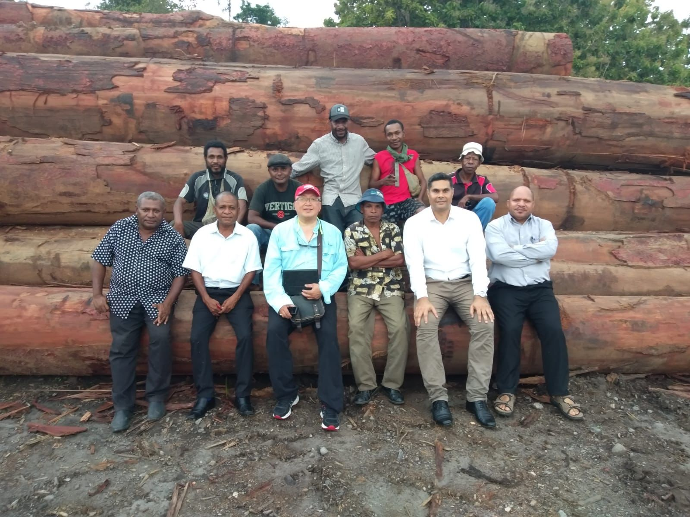
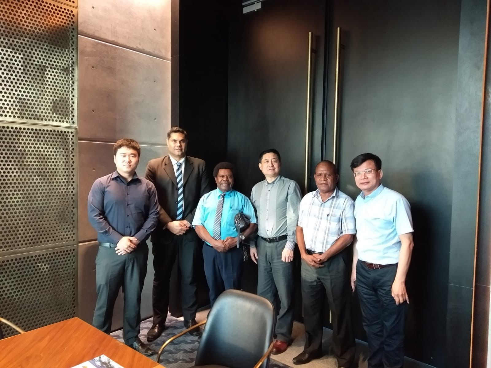
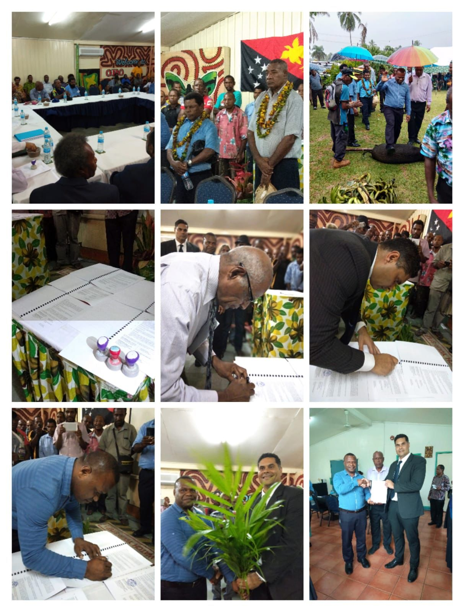
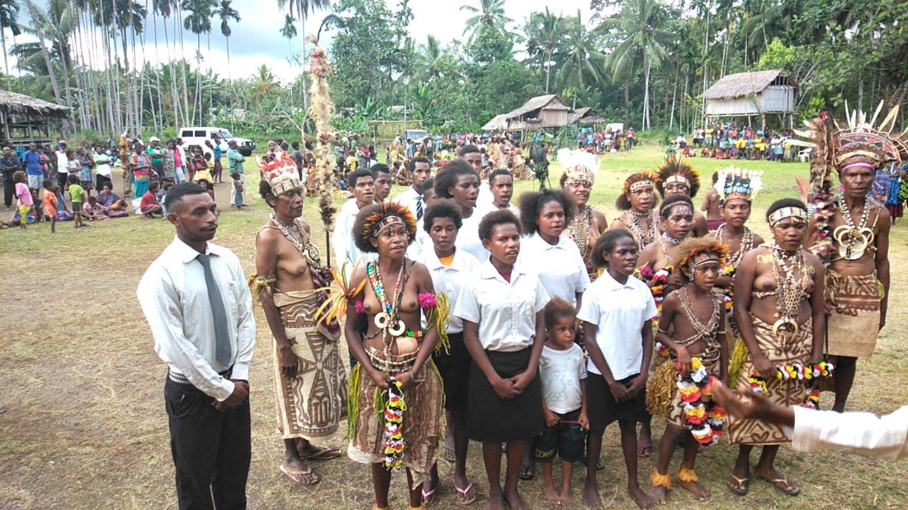

## Our Team

MW has an experienced team of professionals with experience and expertise in disciplines necessary to address the specific challenges of a wide range of projects. 

Our team includes expertise in forestry, geology, biology, scientists and engineers all supported by a finance team that has raised significant capital for various projects around the world. 

For each project, we assemble an experienced team of professionals with experience and expertise in disciplines necessary to address the specific challenges of the project at hand.

#### The MW team has founded, invested and managed many projects including:

- ASX listed mining company Perpetual Resources Limited
- ASX listed agriculture exporter Wingara Ag Limited
- ASX listed baby formula company Wattle Health Australia Limited 
- ASX listed technology company Connexion Media Limited
- ASX listed technology company Fatfish Limited
- Australian licenced medicinal cannabis company One Life Botanical
- Waste to energy gasification company Recovered Energy Australia
- Australia’s largest independent canning factory Blend & Pack
- Large scale house, land and apartment construction projects

### Meet Our Team

##### Mal Michael - Managing Director

Mr Michael has been described by The Guardian Newspaper as one of Papua New Guinea's "living national icons". He is most notable for his successful professional Australian Football League career. Since his retirement from professional football, Mr Michael has forged a successful business career in mining and corporate consultancy. He predominantly deals in the natural resource sector in Papua New Guinea and has represented land owner incorporated companies to help them develop their timber, mining and petroleum assets.

##### Eric Jiang - Chairman

Eric Jiang has over 20 years of experience as an adviser in the financial services industry providing advice to retail and corporate clients. Eric has sat on the boards of ASX listed companies Wattle Health Australia, Wingara Ag, Perpetual Resources and Connexion Media. He was President of The Chinese Community Council of Australia which is the peak body representing the interest of Chinese Australians.

##### George Karafotias – Chief Financial Officer 

Mr Karafotias is an Accountant, holding a Bachelor of Commerce from the University of Adelaide. He has many years experience as a business proprietor and has served as a director on the board of many ASX listed companies. He is currently the CFO for ASX listed Wattle Health Australia. He also provides corporate advisory services to listed and unlisted companies, focusing on restructuring and refinancing. 

##### Simon Penfold 

Simon has over 30 years of experience in the Australian forestry industry and has experience in executive management and all operational facets of developing, maintaining, harvesting and exporting plantations. Simon has worked for forestry companies including, Hancock Victorian Plantations Pty Ltd, Victorian Plantations Corporation, The Department of Conservation & Land Management (WA) and Willmott Forests. Simon is a member of the Institute of Foresters of Australia and the Australian Institute of Company Directors. 

##### Andrew Grant

Andrew is a proven entrepreneur having founded, built and exited several businesses for over 30 years. Andrew has extensive knowledge in design and manufacturing of automated machinery. He has won awards for his design – including the 1999 Young Entrepreneur Award through the Weekly Times and the Hugh McKay Innovators award (NRE excellence in Science) for his design, development and work.

##### Mark Smith

Mark is a seasoned cannabis professional with extensive experience in the development of the industrial hemp and medicinal cannabis industries in Australia, Europe and Asia. He has provided expert advice in the development of company business modelling and due diligence for a number of international cannabis companies. This included advising on land selection, farmer engagement employing in depth technical expertise for the development of the operational plans.

